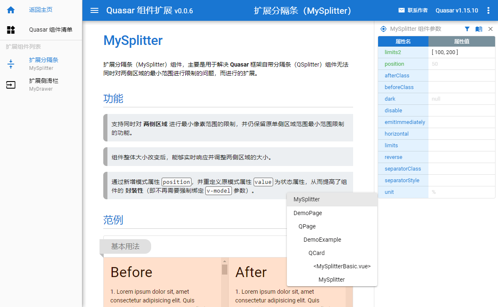

# Quasar Plus (Quasar extended components)

 

> A series of practical components that extend the functions of the built-in components of the Quasar framework, with relevant document examples.
>
> A property panel is provided on the right, so that you can freely select the Vue component on the page, then view its properties, as well as the API help.
>
> A [Quasar component list](https://fictiony.github.io/quasar-plus/#/QuasarComponents) page is also provided, for you to quickly browse and find the Quasar components and related API help you need.



## Usage

```bash
# Installation
yarn

# Test run
quasar dev

# Publish
quasar build
```

## Structure

* [components](src/components/plus) - source codes of Quasar extended components
* [api](src/components/api) - api descriptions of Quasar extended components
* [examples](src/examples) - usage examples of the extended components
* [documents](src/pages/doc) - documents of the extended components
* [live demo](https://fictiony.github.io/quasar-plus) - live demo of documents and examples
* [live demo 2](http://quasarplus.o666o.com) - live demo of documents and examples (alternate link)

## License

[MIT](http://en.wikipedia.org/wiki/MIT_License) (c) 2021 Fictiony Chen <fictiony@qq.com>
