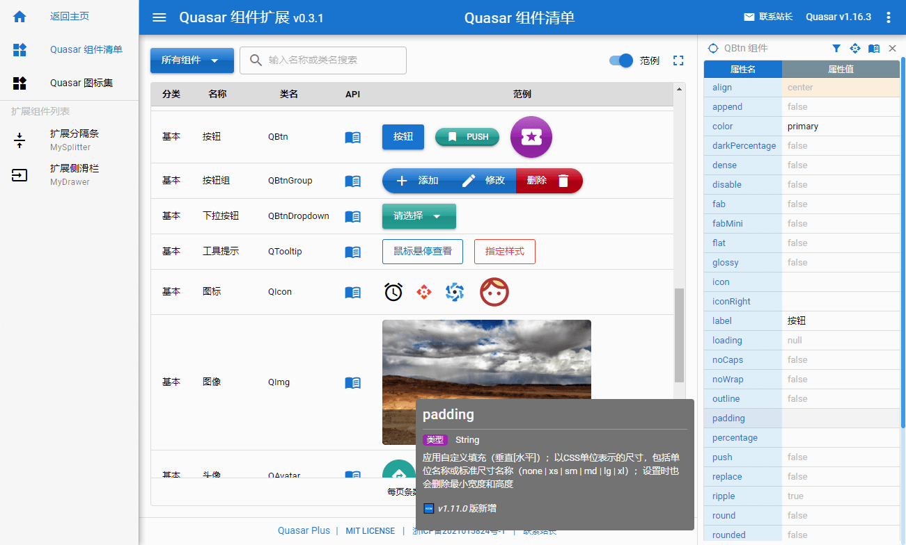

# Quasar Plus (Quasar extended components)

 

> A series of practical components that extend the functions of the built-in components of the Quasar framework, with relevant document examples.
>
> A property panel is provided on the right, so that you can freely select the Vue component on the page, then view its properties, as well as the API help.
>
> We provide a [Quasar component list](https://fictiony.github.io/quasar-plus/#/QuasarComponents) page, for you to quickly browse and find the Quasar components and related API help documents that you need.



> We also provide a [Quasar icon sets](https://fictiony.github.io/quasar-plus/#/QuasarIconSets) page, for you can speedly find the icons you want to use.


## Usage

```bash
# Installation
yarn

# Test run
quasar dev

# Publish
quasar build
```

## Structure

* [components](src/components/plus) - Source codes of Quasar extended components
* [api](src/components/api) - API descriptions of Quasar extended components (with chinese API of Quasar built-in components)
* [examples](src/examples) - usage examples of the extended components
* [documents](src/pages/doc) - documents of the extended components
* [live demo](https://fictiony.github.io/quasar-plus) - live demo
* [live demo 2](http://quasarplus.o666o.com) - alternate link of live demo

## License

[MIT](http://en.wikipedia.org/wiki/MIT_License) ©️2021 Fictiony Chen <fictiony@qq.com>
