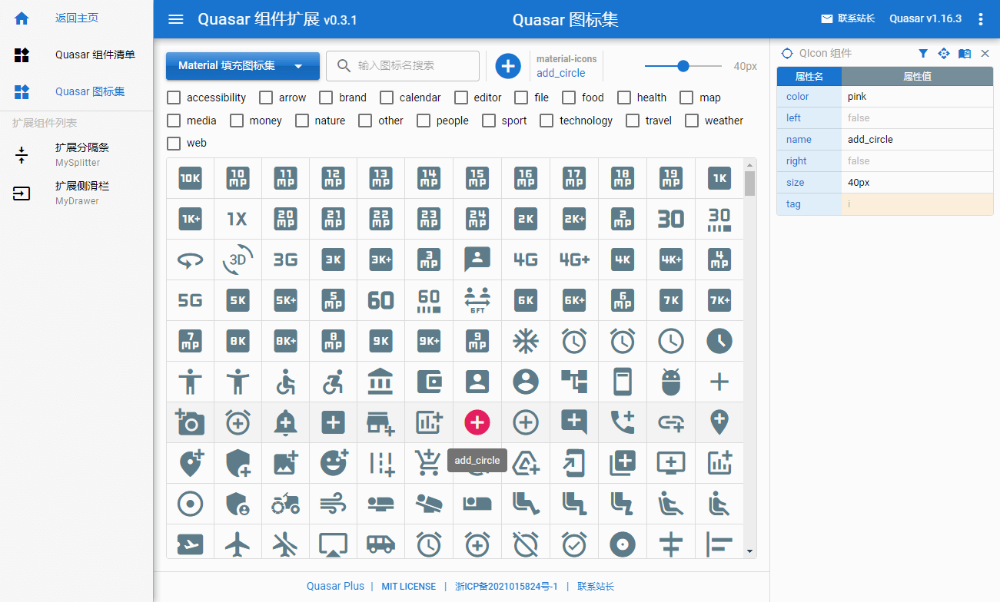

# Quasar Plus （Quasar 组件扩展）

 

> 包含一系列对 Quasar 框架自带组件进行功能扩展后的实用组件，以及相关文档范例。
>
> 右侧提供了一个属性栏，可自由选择查看页面内的 Vue 组件属性，并获取 API 帮助。
>
> 我们提供了一个 [Quasar 组件清单](https://fictiony.github.io/quasar-plus/#/QuasarComponents) 页面，供用户快速浏览并查找所需的 Quasar 组件及相关 API 帮助。


> 我们还提供了一个 [Quasar 图标集](https://fictiony.github.io/quasar-plus/#/QuasarIconSet) 页面，以方便用户快速搜索想用的图标。



## 使用

```bash
# 安装
yarn

# 测试运行
quasar dev

# 发布
quasar build
```

## 目录指引

* [扩展组件](src/components/plus) - Quasar 扩展组件源码
* [组件API](src/components/api) - Quasar 扩展组件 API 接口说明（以及 Quasar 自带组件的中文 API）
* [范例](src/examples) - 扩展组件使用范例
* [文档](src/pages/doc) - 扩展组件介绍文档
* [在线演示](https://fictiony.github.io/quasar-plus) - 在线演示
* [在线演示2](http://quasarplus.o666o.com) - 在线演示备用地址

## 授权

[MIT](http://en.wikipedia.org/wiki/MIT_License) ©️2021 Fictiony Chen <fictiony@qq.com>
